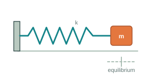
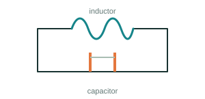
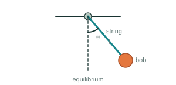

# Second-Order Systems

## Introduction

Consider a block of mass \(m\) attached to a spring on a smooth horizontal surface. The other end of the spring is fixed to a wall.

For now, assume that the surface is frictionless and the spring is ideal.

When the spring is neither stretched nor compressed, the block is at its **equilibrium position**. We call this position:

\[
x=0
\]

**[Diagram: spring–mass system at equilibrium]**

Now pull the block to the right by a distance \(x\) and hold it there.

The spring is stretched.

**[Diagram: mass displaced to the right by \(x\)]**

Then release the block.

**What happens next?**

Will the block return to its equilibrium position and stop?

Before writing any equations, **let's try to understand what the block will do and why.**

---

## 1. What Happens After We Release It?

### At equilibrium

The block is at \(x=0\).

The spring is neither stretched nor compressed, so there is no horizontal force from the spring.

### Displace and release

Pull the block to the right by a distance \(x\) and release it.

The spring is now stretched and pulls the block toward the equilibrium position.

The block starts moving toward equilibrium.

As it gets closer, the spring becomes less stretched, so the force pulling it back becomes smaller.

When the block reaches the equilibrium position, the spring is no longer stretched.

So the spring force becomes zero.

**But does the block stop?**

No.

The block is already moving and has **momentum**, so it continues past the equilibrium position.

Now the spring becomes compressed and pushes the block in the opposite direction.

The block slows down and eventually stops for an instant.

But by this point, the spring is already compressed and is exerting a force toward the equilibrium position.

So the block starts moving back toward equilibrium.

The same process repeats.

> **The spring keeps pulling or pushing the block toward equilibrium, while the block's momentum carries it past equilibrium.**

This back-and-forth motion is called **oscillation**.

---

## 2. Can We Describe This Motion Using Forces?

We now know what the block does.

But **what causes its motion to change?**

Let's look at the block at some position \(x\) to the right of equilibrium.

The spring is stretched, so it pulls the block toward equilibrium.

**[Diagram: block displaced to the right, with equilibrium position marked and spring force pointing left]**

The farther we stretch the spring, the stronger this force becomes.

For an ideal spring, this is described by **Hooke's law**:

\[
F_s=-kx
\]

where:

- \(x\) is the displacement from equilibrium
- \(k\) is the spring constant
- the negative sign tells us that the spring force acts **opposite to the displacement**

So if the block is displaced to the right, the spring force acts to the left.

If the block is displaced to the left, the spring force acts to the right.

> **The spring force always acts toward the equilibrium position.**

Now apply Newton's second law:

\[
F=ma
\]

The only horizontal force on our ideal block is the spring force, so:

\[
ma=-kx
\]

or:

\[
a=-\frac{k}{m}x
\]

This tells us something important:

> **The position of the block determines its acceleration.**

The farther the block is from equilibrium, the greater its acceleration toward equilibrium.

At equilibrium, \(x=0\), so:

\[
a=0
\]

But as we discovered earlier, **zero acceleration does not mean zero velocity**. The block can pass through equilibrium with momentum even though its acceleration is zero at that instant.

---

## 3. From Acceleration to a Differential Equation

We found that:

\[
a=-\frac{k}{m}x
\]

So the acceleration of the block depends on its position.

But what exactly is acceleration?

Velocity tells us how quickly position is changing:

\[
v=\frac{dx}{dt}
\]

Acceleration tells us how quickly velocity is changing:

\[
a=\frac{dv}{dt}
\]

Since velocity itself is the rate of change of position:

\[
a=\frac{d}{dt}\left(\frac{dx}{dt}\right)
\]

or:

\[
a=\frac{d^2x}{dt^2}
\]

Now substitute this into the relationship we found from Newton's law:

\[
\frac{d^2x}{dt^2}=-\frac{k}{m}x
\]

Rearranging:

\[
m\frac{d^2x}{dt^2}+kx=0
\]

We have arrived at our equation of motion.

But notice something different from the systems we studied earlier.

The equation contains the **second derivative of position**.

That is why we call it a **second-order differential equation**.

> **The order of a differential equation is determined by the highest derivative that appears in it.**

For our spring–mass system, the chain is:

**Position → Spring force → Acceleration → Second derivative of position**

And that's where the second-order equation comes from.

---

## 4. What Does the Equation Tell Us?

We found:

\[
a=-\frac{k}{m}x
\]

There is already a lot we can understand from this equation.

If the block is to the **right** of equilibrium, \(x>0\), so the acceleration is negative — toward the left.

If the block is to the **left** of equilibrium, \(x<0\), so the acceleration is positive — toward the right.

At equilibrium:

\[
x=0
\]

so:

\[
a=0
\]

The acceleration always points **toward the equilibrium position**.

The equation also tells us how the system changes when we change its physical properties.

A larger displacement \(x\) produces a larger acceleration toward equilibrium.

A stiffer spring — larger \(k\) — produces a larger acceleration.

A heavier mass — larger \(m\) — produces a smaller acceleration.

So even without solving the equation, we can already make predictions about the motion.

### But we still don't know the exact motion

The equation does **not tell us exactly how the block will move unless we also know its initial state**.

Suppose at some instant:

\[
x=2\text{ cm}
\]

The block could be moving toward equilibrium.

It could be moving away from equilibrium.

Or it could be momentarily at rest.

Knowing its position alone is not enough.

We also need to know its **velocity**.

So to predict the motion of our spring–mass system, we need two pieces of information:

\[
x(0)=\text{initial position}
\]

\[
v(0)=\text{initial velocity}
\]

These are called the **initial conditions**.

> **For this second-order system, knowing where the block starts is not enough. We also need to know how it is moving.**

---

## 5. What Should the Curve Look Like?

Let's return to our original experiment.

We pull the block to the right and release it from rest.

At the moment we release it:

- displacement is maximum
- velocity is zero
- spring force is maximum
- acceleration toward equilibrium is maximum

As the block moves toward equilibrium, displacement decreases.

So spring force and acceleration decrease.

At equilibrium:

\[
x=0
\]

Spring force and acceleration are zero.

But the block has momentum, so it continues past equilibrium.

On the other side, the spring pushes it back.

The block slows until it reaches maximum displacement on the other side, where its velocity becomes zero.

Then the motion reverses.

Because our ideal system has **no friction or resistance**, there is nothing to gradually remove energy, so the same motion repeats.

### What should the graph look like?

If we plot displacement \(x\) against time, we expect:

**maximum → equilibrium → minimum → equilibrium → maximum → ...**

The motion repeats.

> **From the physics alone, we can predict that the displacement should vary repeatedly between two extremes.**

At the extremes, the velocity is zero, so the displacement–time graph should be flat.

As the block approaches equilibrium, its speed increases, so the graph becomes steeper.

At equilibrium, the acceleration is zero but the speed is maximum, so the graph is steepest.

**[Diagram: five spring–mass states mapped to a displacement–time curve]**

### Why not a triangular curve?

A triangular displacement–time graph would contain straight-line segments.

Straight lines would mean constant velocity and therefore zero acceleration between the corners.

At the corners, the velocity would have to reverse abruptly.

But our equation says:

\[
a=-\frac{k}{m}x
\]

The acceleration changes continuously with position.

So the motion should be smooth rather than made of straight segments and sharp corners.

But we still don't know the exact mathematical shape.

**Now let's see what the differential equation predicts.**

---

## 6. Solving the Differential Equation

We found that the motion of the block is described by:

\[
\frac{d^2x}{dt^2}=-\frac{k}{m}x
\]

Look carefully at what this equation is telling us.

We need a function whose **second derivative has the same shape as the original function, but with the opposite sign**.

What kind of function behaves like this?

Consider:

\[
x(t)=A\cos(\omega t)
\]

Differentiate once:

\[
\frac{dx}{dt}=-A\omega\sin(\omega t)
\]

Differentiate again:

\[
\frac{d^2x}{dt^2}=-A\omega^2\cos(\omega t)
\]

Since:

\[
A\cos(\omega t)=x(t)
\]

we can write:

\[
\frac{d^2x}{dt^2}=-\omega^2x
\]

Compare this with our spring–mass equation:

\[
\frac{d^2x}{dt^2}=-\frac{k}{m}x
\]

Therefore:

\[
\omega^2=\frac{k}{m}
\]

or:

\[
\boxed{\omega=\sqrt{\frac{k}{m}}}
\]

### What about our initial conditions?

Earlier, we saw that a second-order system needs two pieces of information to determine its motion: **initial position and initial velocity**.

In our experiment, we pulled the block to \(x=A\) and released it from rest.

So:

\[
x(0)=A
\]

and:

\[
v(0)=0
\]

Now check our proposed solution:

\[
x(t)=A\cos(\omega t)
\]

At \(t=0\):

\[
x(0)=A\cos(0)=A
\]

And its velocity is:

\[
v(t)=-A\omega\sin(\omega t)
\]

so:

\[
v(0)=0
\]

It satisfies both initial conditions.

Therefore, for our experiment:

\[
\boxed{x(t)=A\cos\left(\sqrt{\frac{k}{m}}\,t\right)}
\]

We predicted from the physics that the block would move smoothly back and forth between two extremes.

Now the mathematics gives us the exact shape of that motion.

> **The displacement varies sinusoidally with time.**

---

## 7. What Does the Solution Tell Us?

We found:

\[
x(t)=A\cos(\omega t)
\]

where:

\[
\omega=\sqrt{\frac{k}{m}}
\]

Now let's see what this solution tells us about the physical system.

### Amplitude \(A\)

\(A\) is the maximum displacement from equilibrium.

In our experiment, it is simply how far we pulled the block before releasing it.

A larger \(A\) means the block travels farther from equilibrium.

But notice:

\[
\omega=\sqrt{\frac{k}{m}}
\]

There is no \(A\) in this expression.

So for our ideal spring:

> **Pulling the block farther changes the amplitude, but not how quickly it oscillates.**

### What does \(k\) do?

\(k\) tells us how stiff the spring is.

From:

\[
\omega=\sqrt{\frac{k}{m}}
\]

increasing \(k\) increases \(\omega\).

This agrees with our physical intuition: a stiffer spring produces a stronger restoring force for the same displacement.

> **Stiffer spring → faster oscillation**

### What does \(m\) do?

Now imagine replacing the block with a heavier one.

Increasing \(m\) decreases \(\omega\).

The same spring now has to accelerate a larger mass.

> **Heavier mass → slower oscillation**

### How long does one oscillation take?

\(\omega\) is called the **angular frequency**.

One complete oscillation corresponds to \(2\pi\) radians, so the time taken for one complete oscillation—the **period \(T\)**—is:

\[
T=\frac{2\pi}{\omega}
\]

Substituting:

\[
\omega=\sqrt{\frac{k}{m}}
\]

gives:

\[
\boxed{T=2\pi\sqrt{\frac{m}{k}}}
\]

So:

**larger \(m\) → larger \(T\) → slower oscillation**

**larger \(k\) → smaller \(T\) → faster oscillation**

The **frequency \(f\)** tells us how many complete oscillations occur each second:

\[
f=\frac{1}{T}
\]

Therefore:

\[
\boxed{f=\frac{1}{2\pi}\sqrt{\frac{k}{m}}}
\]

So the mathematics doesn't just tell us the shape of the motion.

It tells us **how far the block moves and how quickly the motion repeats.**

### What Does the Motion Look Like Over Time?

The block moves back and forth along a straight line.

But if we continuously record its position as time moves forward, something interesting appears.

**[Interactive visual: horizontal spring–mass motion projected onto a displacement–time trace, with time increasing upward]**

> **The wave is simply a record of the block's position as time passes.**

---

## 8. Test It Yourself

**Before calculating, try to predict.**

### Make the spring stiffer

Keep the mass the same and increase \(k\).

- Will the block oscillate faster or slower?
- Will the period become longer or shorter?

After making your prediction, compare it with:

\[
T=2\pi\sqrt{\frac{m}{k}}
\]

A larger \(k\) gives a smaller \(T\).

> **Larger \(k\) → smaller \(T\) → faster oscillation**

**[Interactive comparison: original spring and stiffer spring moving over the same time interval]**

### Make the block heavier

Keep the spring the same and increase \(m\).

- Will the block oscillate faster or slower?
- Will the period become longer or shorter?

Again, compare your prediction with:

\[
T=2\pi\sqrt{\frac{m}{k}}
\]

A larger \(m\) gives a larger \(T\).

> **Larger \(m\) → larger \(T\) → slower oscillation**

**[Interactive comparison: original mass and heavier mass moving over the same time interval]**

---

## 9. One Idea, Many Systems

We discovered second-order behavior using a mass and a spring.

But the same mathematical structure appears in very different physical systems.

### Mechanical — Spring–Mass

\[
m\frac{d^2x}{dt^2}+kx=0
\]

or:

\[
\frac{d^2x}{dt^2}+\frac{k}{m}x=0
\]

and:

\[
x(t)=A\cos(\omega t)
\]

where:

\[
\omega=\sqrt{\frac{k}{m}}
\]

The block moves back and forth around its equilibrium position.

### Electrical — LC Circuit

Now consider something that looks completely different: an inductor and a capacitor connected together.

\[
L\frac{d^2q}{dt^2}+\frac{1}{C}q=0
\]

or:

\[
\frac{d^2q}{dt^2}+\frac{1}{LC}q=0
\]

Its solution has the same form:

\[
q(t)=Q\cos(\omega t)
\]

where:

\[
\omega=\frac{1}{\sqrt{LC}}
\]

Instead of a block moving back and forth, electrical energy moves back and forth between the capacitor and the inductor.

Different physical system.

**Same mathematical behavior.**

### Mechanical — Pendulum

Now consider a pendulum swinging through small angles.

For small oscillations:

\[
\frac{d^2\theta}{dt^2}+\frac{g}{l}\theta=0
\]

Its solution again has the same form:

\[
\theta(t)=\Theta\cos(\omega t)
\]

where:

\[
\omega=\sqrt{\frac{g}{l}}
\]

The pendulum swings back and forth around its equilibrium position.

Again, the physical system is different.

But the mathematics looks familiar.

### The Common Pattern

\[
\text{Spring–mass:}\quad
\frac{d^2x}{dt^2}+\frac{k}{m}x=0
\]

\[
\text{LC circuit:}\quad
\frac{d^2q}{dt^2}+\frac{1}{LC}q=0
\]

\[
\text{Pendulum:}\quad
\frac{d^2\theta}{dt^2}+\frac{g}{l}\theta=0
\]

All three have the form:

\[
\boxed{\frac{d^2y}{dt^2}+\omega^2y=0}
\]

> **Different physical systems. The same mathematical structure.**

And once we recognize that structure, understanding one system can help us understand many others.

---

We started with a block and a spring.

From the forces acting on it, we discovered a second-order differential equation.

That equation predicted something remarkable: a motion that repeats itself.

But why do systems oscillate? And what determines the rhythm of that motion?

**Next: Oscillations**
